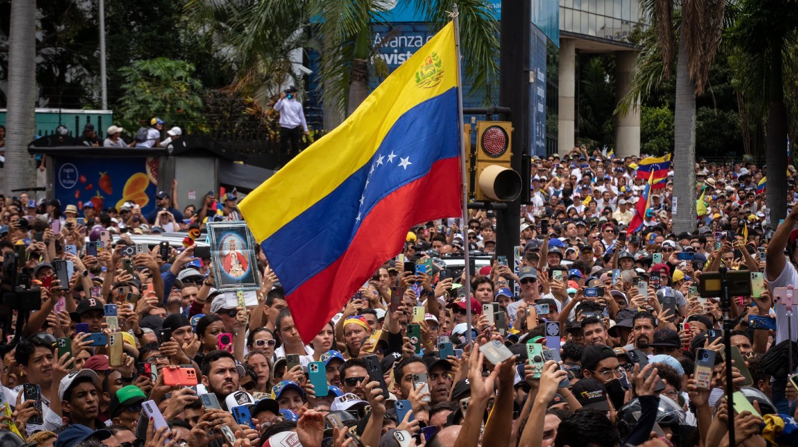

## Context

Venezuela has been through almost two decades of on-going riots, they were particularly intense during 2014 to 2019 and recently in 2024-2025. This intensity was fueled by rigged elections (multiple times), basic products scarcity, hyperinflation, governmental sabotage in public universities, lack of basic services (electricity, water), corruption and the list goes on. In this tab we will focus on Venezuela, specially during these time period, and I will provide more details on the reasons and the people.


This dataframe is from ACLED, but it has more information (like event type and sub-type), so it will allows us to make a more detailed overview of Venezuela's situation. [^1]

[^1]: Downloaded on December 22nd, 2025

```{r}
library(ggplot2)
library(ggiraph)
library(gghighlight)
library(tidyverse)
library(gt)
library(readxl)

df_vnzl <- read_excel("datos/Latin-America-the-Caribbean_aggregated_data_up_to-2025-12-06.xlsx")

df_vnzl <- df_vnzl |> filter(COUNTRY=="Venezuela")
```

------------------------------------------------------------------------

## El Pueblo

Before we look at the data, I want you to look at the names. These numbers are people, that should be on top of your head as you read the rest of this. [^2]

*These are the registered victims of the Venezuelan riots of 2014, 2017 and 2024.*

[^2]: This carousel was done taking inspiration from: https://github.com/dimanech/scroll-snap-carousel and some (a lot) of Googling.

```{r}
library(rvest)
library(dplyr)
library(janitor)
library(stringr)
library(htmltools)

# Function to scrape and clean
scrape_victims <- function(url) {
  read_html(url) |>
    html_node("table") |>
    html_table(fill = TRUE) |>
    clean_names() |>
    select(Name = nombre, Age = edad) |>
    mutate(
      Age = as.numeric(Age),
      Name = str_remove_all(Name, "\\[.*?\\]|\\(.*?\\)")
    )
}

# URLs to scrape
urls <- c(
  "https://es.wikipedia.org/wiki/Anexo:Fallecidos_durante_las_protestas_en_Venezuela_de_2014",
  "https://es.wikipedia.org/wiki/Anexo:Fallecidos_durante_las_protestas_en_Venezuela_de_2017",
  "https://es.wikipedia.org/wiki/Anexo:Fallecidos_durante_las_protestas_en_Venezuela_de_2024"
)

# Scrape all pages
victims_list <- lapply(urls, scrape_victims)
victims_all <- bind_rows(victims_list)

# Create horizontal scroll cards with black-and-white theme
cards <- lapply(1:nrow(victims_all), function(i) {
  htmltools::tags$div(
    style = paste(
      "flex: 0 0 200px;",
      "border:1px solid #000;",        # black 
      "border-radius:8px;",
      "padding:20px;",
      "margin:2px;",
      "height:150px;",
      "text-align:center;",
      "background-color:#fff;",        # white 
      "color:#000;",                   # black 
      "box-shadow: 2px 2px 5px rgba(0,0,0,0.2);"  # shadow
    ),
    htmltools::tags$strong(victims_all$Name[i]),
    htmltools::tags$br(),
    paste("Age:", victims_all$Age[i])
  )
})

# Carousel container with horizontal scroll
carousel <- htmltools::tags$div(
  style = paste(
    "display: flex;",
    "overflow-x: auto;",
    "scroll-snap-type: x mandatory;", 
    "padding: 10px;",
    "background-color:#000;"  # black background  
  ),
  cards
)


htmltools::browsable(carousel)

```

------------------------------------------------------------------------

## Trends & Look Up


::: column-margin

{fig-align="center"}
:::


After a tough start, I know, we will see the evolution of Venezuela protests' fatalities, as we did in the global case, just that this time by event type:


```{r}

p.vnzl <- df_vnzl |>
  ggplot(aes(
    x = WEEK,
    y = EVENTS,
    group = EVENT_TYPE,
    data_id = EVENT_TYPE,
    color = EVENT_TYPE
  )) +
  geom_line_interactive(
    linewidth = 0.5,
    hover_nearest = TRUE, 
    aes(tooltip = EVENT_TYPE)
  ) +
  scale_color_brewer() +
  labs(
    x = "Weeks",
    y = "Number of events",
    title = "Eventful Trend",
  )

p.vnzl <- girafe(ggobj = p.vnzl)
p.vnzl


```
Given that the frequency is by weeks, the evolution doesn't tell much information. Therefore I provide the same look-up table as for the global case:

```{r}
gt <- df_vnzl |>
  dplyr::select(
    COUNTRY, FATALITIES, EVENTS, EVENT_TYPE, SUB_EVENT_TYPE, WEEK)

gt |>
  gt() |>
  opt_interactive(    use_search = TRUE,
    use_filters = TRUE,
    use_resizers = FALSE,
    use_highlight = TRUE,
    use_compact_mode = FALSE,
    use_text_wrapping = FALSE,
    use_page_size_select = TRUE)
```


------------------------------------------------------------------------

## Most Fatal Events

Coming from the previous graphs and table, I became interested in which type of sub- event (to get more specific) caused the most fatalities in total. We calculate and showcase as follows:

```{r}
bar.vnzl <- df_vnzl |>
  group_by(SUB_EVENT_TYPE) |>
  summarise(
    total_fatal = sum(FATALITIES, na.rm = TRUE)
  ) |>
  arrange(desc(total_fatal)) |>
  slice_head(n = 10) |> 
  ggplot( aes(
    x = reorder(SUB_EVENT_TYPE, total_fatal),
    y = total_fatal,
    tooltip = paste(
      "Sub-event type:", SUB_EVENT_TYPE,
      "<br>Total fatalities:", total_fatal
    ),
    data_id = SUB_EVENT_TYPE
  )
) +
  geom_bar_interactive(
    fill = "#003B5D",
    stat = "identity",
    width = 0.7
  ) +
  coord_flip() +
  theme_classic() +
  labs(
    x = "Sub-event type",
    y = "Number of fatalities",
    title = "Top 10 sub-event types by fatalities"
  )

girafe(
  ggobj = bar.vnzl,
  options = list(
    opts_hover(css = "fill:orange;"),
    opts_selection(type = "none")
  )
)

```

------------------------------------------------------------------------

## Closure

Our national anthem is "Gloria al Bravo Pueblo", and sadly, that is exactly what we've had to be. Venezuela lives in scarcity and extreme poverty, from which you can take a break from in Las Mercedes [^3]. Limited access to water, national 'apagones' that last weeks, food scarcity and hideous prices due to hyperinflation and speculation... Students who can't study, full-time workers getting paid 3\$ a month; this is the Venezuela that still fights, that goes out and riots after years of an ilegitimate government. Knowing there is no institutional back-up, that their institutions are the ones shooting at them.

[^3]: Las Mercedes is a rich (bubble) suburb in Venezuela. It is in the capital, Caracas.

Resilience should not be required to live a worthy life.

<br>
